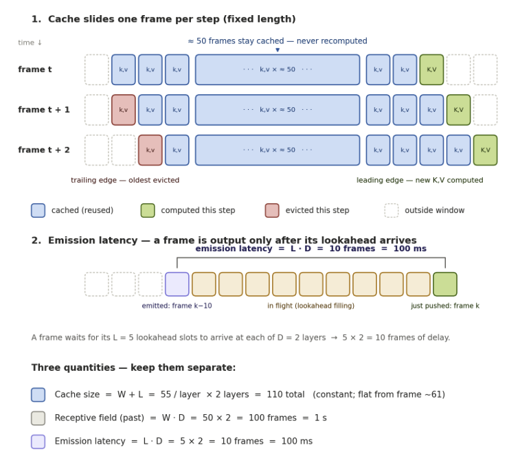
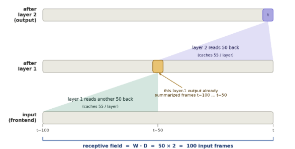

# vadexplore

Frame-level voice activity detection on a LibriSpeech-style corpus: corpus
analysis, a frozen speaker-disjoint split, two swappable temporal models, an
augmentation and robustness harness, reference-VAD baselines, and a real-time
microphone demo.

Every design default, the evidence behind it, and the full experimental
write-up live in my report: [tex_report/Report.pdf](tex_report/Report.pdf)
(source: [Report.tex](tex_report/Report.tex)).
This file is the operating manual: how to run each thing the project offers.

Frame grid is fixed project-wide: **16 kHz, 10 ms hop, 25 ms window, 40 log-mel
bins, 100 fps**. Frame `i` covers `[i/100, (i+1)/100)` in both features and labels.

---

## 1. Install

Python is pinned to **3.11** (`>=3.11,<3.12`). Create a virtual environment
first — the venv is what gives you the `python` command, and its path is baked
into it, so build it inside the repo and do not move the directory afterwards.

```bash
python3.11 -m venv .venv
source .venv/bin/activate        # Windows: .venv\Scripts\activate
```

Then install, either way — both give the identical pinned set:

```bash
# A. from requirements files
pip install -r requirements-dev.txt   # runtime + test tools
pip install -e . --no-deps            # put vadexplore itself on the import path

# B. from pyproject (one command, same result)
pip install -e ".[dev]"
```

Drop `-dev` / `[dev]` if you do not intend to run the tests. Torch and
torchaudio are most of a 2 GB download, so give it a few minutes.

Verify:

```bash
pytest -q                        # 299 tests, ~13 s, no GPU and no dataset needed
```

Both routes install the same versions, because
[requirements.txt](requirements.txt) mirrors `[project.dependencies]` in
[pyproject.toml](pyproject.toml) line for line, and
[requirements-dev.txt](requirements-dev.txt) adds the `dev` extra. `pip install
-e .` is what makes `import vadexplore` work from any directory; every script in
[scripts/](scripts/) relies on it.

### What each library is for

| Library | Version | Needed for |
|---|---|---|
| `numpy` | 2.4.6 | arrays everywhere: features, labels, metrics |
| `torch` | 2.13.0 | model, training loop, streaming session, Silero via `torch.hub` |
| `torchaudio` | 2.11.0 | resampling and the mel filterbank |
| `soundfile` | 0.14.0 | WAV decode in the loader, RIR/MUSAN reads, live recording |
| `matplotlib` | 3.11.1 | every figure, and the live scrolling display |
| `pyyaml` | 6.0.3 | training configs in [configs/](configs/) |
| `tqdm` | 4.70.0 | training progress bars |
| `pandas` | 3.0.5 | reads the RIR bank `metadata.csv` in `augment.py` |
| `webrtcvad` | 2.0.10 | the WebRTC reference baseline (§10) |
| `sounddevice` | 0.5.6 | microphone capture for the live demo (§4) |

Optional, `dev` extra only:

| Library | Version | Needed for |
|---|---|---|
| `pytest` | 9.1.1 | the test suite |
| `scipy` | 1.17.1 | tests only — cross-checks the hand-written high-pass |

## 2. External data

| What | Where to get it | Path to point the code at | Needed for |
|---|---|---|---|
| VAD corpus (`*.wav` + `*.json` pairs) | [download](https://drive.google.com/file/d/1qfg9oofmN6N5jRZqw5lne8php9YNgN29/view?usp=share_link) | `path/to/vad_data` | everything |
| RIR bank (`rirs/metadata.csv` + `target/`, `noise/` as `.npy`) | [download](https://drive.google.com/file/d/1YVsgqawYlHtjspH1msu5KwPN_PMf9IhV/view?usp=share_link) | `path/to/rirs` | augmentation, robustness |
| MUSAN (`music/`, `noise/` as `.wav`) | [download](https://openslr.trmal.net/resources/17/musan.tar.gz) | `path/to/musan` | augmentation, robustness |
| Silero VAD | [snakers4/silero-vad](https://github.com/snakers4/silero-vad) | `~/.cache/torch/hub` (fetched automatically) | cross-check, baselines, robustness |

Nothing above is committed. Fetch each one, put it wherever you like, and pass
the path in — no default in this repo points at a real location on your disk.

Silero is fetched once through `torch.hub` and needs network access on that
first call only:

```bash
python -c "import torch; torch.hub.load('snakers4/silero-vad', 'silero_vad', trust_repo=True)"
```

If it cannot be fetched, `vadexplore.silero` raises `SileroUnavailable` with
instructions. It never substitutes a fallback detector.

Every path is given by flag (`--rir-dir`, `--musan-dir`, positional
`dataset_dir`) or in the YAML config. Throughout this file, and in
[configs/](configs/) and the script defaults, `path/to/...` is a placeholder —
substitute your own location.

The tests take no flags, so the 12 augmentation tests that need real corpora
read environment variables instead and skip when they are unset:

```bash
export VADEXPLORE_DATA_DIR=path/to/vad_data
export VADEXPLORE_RIR_DIR=path/to/rirs
export VADEXPLORE_MUSAN_DIR=path/to/musan
```

## 3. Pipeline order

```
runs/<name>/best.pt ──> live_mic_vad                            (§4 live demo)

loader ──> labels ──> stats/silero ──> figures + JSON            (§5 analysis)
                          │
                          └──> make_split ──> feature_stats       (§6 split)
                                    │
                                    ├──> train ──> runs/<name>/best.pt   (§7)
                                    │        └──> augment (train only)
                                    │
                                    ├──> evaluate ──> eval_test.json      (§8)
                                    ├──> postproc_sweep                    (§9)
                                    ├──> eval_baselines (Silero, WebRTC)  (§10)
                                    └──> robustness_eval                  (§11)
```

Signal path, identical in training, offline evaluation, and live:
**read → resample to 16 kHz → 80 Hz zero-phase high-pass → log-mel → normalize
with train-partition statistics**. Augmentation, when on, is inserted on the
waveform *before* the high-pass.

The live demo comes first because the trained checkpoints are committed: you can
hear the system work before reproducing any of the analysis or the training
below.

---

## 4. Live microphone demo

### Recorded demos

Two screen recordings of the streaming model running live, no setup required:

| Demo | Model | Watch |
|---|---|---|
| Clean-trained | `causal_attn`, no augmentation | [video](https://drive.google.com/file/d/1Ij81wTB_7ZKpcd4bSbIuG_ZCQKxolOeT/view?usp=share_link) |
| Augmented-trained | `causal_attn`, RIR + MUSAN augmentation | [video](https://drive.google.com/file/d/1OW06Zd0HRDSx0BCoe0Zidx-YYyoocdpP/view?usp=sharing) |

The pair is the point. Both are the same `causal_attn` architecture with the
same 1 s window, each at its own operational threshold; the only difference is
what they saw during training. On the noisy test set my report measures the
clean-trained model at **25.80 % EER** and 1327 false alarms per hour — it stops
discriminating and calls almost everything speech, which is what finger snaps
and table taps trigger in the video. The augmented model brings that to **6.89 %
EER** and 159 FA/h, costing 0.49 EER points on clean audio (2.47 % → 2.96 %).
See my report, §11 (*Robustness to noise and reverberation*) for the full table,
and §13 (*Live streaming demo*) for the demo write-up.

Reproduce them yourself:

```bash
python scripts/live_mic_vad.py --run runs/attn_pw_1s        # the clean-trained video
python scripts/live_mic_vad.py --run runs/attn_augmented    # the augmented video
```

### Run it

```bash
python scripts/live_mic_vad.py                                  # default runs/sweep_past_window/attn_pw_1s
python scripts/live_mic_vad.py --run runs/attn_pw_1s --window-seconds 8
python scripts/live_mic_vad.py --input-wav clip.wav --no-plot   # offline verification, no mic
```

Requires a `causal_attn` checkpoint. `StreamingVADSession` rejects a BiGRU core
with an explanatory error: it is bidirectional by default and carries unbounded
recurrent state, so a windowed KV cache means nothing for it.

Nothing is reimplemented. The high-pass, the log-mel, the saved training feature
statistics, the model, and the frame-by-frame session are the same objects the
offline path uses. Normalization uses the **saved training statistics**;
computing them from live audio would fail quietly, producing plausible-looking
probabilities that are simply wrong.

**Threading.** The `sounddevice` callback only copies the block into a queue and
returns. A `FuncAnimation` consumer drains the queue, advances the front-end and
the model, and redraws. Feature work in the audio callback causes dropouts;
matplotlib work there causes a crash.

**Causal post-processing** (`CausalPostprocessor`) is the streaming-safe subset:
trailing median smoothing (no latency, but it reacts half a window late — that
is the price of causality and it is declared, not hidden) and hangover (fires
after an offset and extends forward, so it is free). Minimum speech duration is
deliberately **not** implemented: deciding a segment is long enough means waiting
for it to end, a delay of the full minimum duration. It stays offline-only.

`latency_report` itemizes every source of delay: audio block, high-pass margin,
25 ms analysis-window tail, model lookahead (`lookahead_frames × attn_layers`),
trailing smoothing. Hangover is listed at zero.



Three quantities that are easy to conflate. For the shipped `causal_attn` config
(`W = 50` per layer, `L = 5` per layer, `D = 2` layers):

| quantity | formula | value |
| --- | --- | --- |
| Cache size | `(W + L) × D` | 110 entries, flat from frame 60 onward |
| Receptive field (past) | `W · D` | 100 frames = 1 s |
| Emission latency | `L · D` | 10 frames = 100 ms |

**The cache and the window do different jobs.** The cache removes
recomputation: each frame's key and value are projected once, on the leading
edge, then reused by every later query that attends to it. But a cache is a
store, not a bound. The *window* is what bounds memory —
[`_evict`](vadexplore/model.py#L513) returns immediately when `past_window is
None`, so with an unbounded window the identical code grows linearly in stream
length (2395 entries after 12 s, against a flat 110). Constant memory is a
property of the window, not of the cache.

Flags: `--run --stats --threshold --target-fa-per-hour --window-seconds
--block-ms --redraw-ms --smooth-ms --hangover-ms --device --record --log
--input-wav --no-plot`. With no `--threshold`, the operating point is read from
the run's `eval_test.json` for the given FA target.

---

## 5. Data analysis

### Run it

```bash
python -m vadexplore.loader path/to/vad_data          # hygiene one-liner
python scripts/corpus_report.py path/to/vad_data      # -> explore_out/corpus_stats.json + 8 figures
python scripts/crosscheck_silero.py path/to/vad_data  # -> explore_out/silero_agreement.json + figures
python scripts/plot_examples.py path/to/vad_data      # -> explore_out/examples/*.png
```

The two JSON artifacts are the analysis output: every number quoted in the table
below and in the written report is read back from them, so nothing is hardcoded
and the prose cannot drift from the code.

### What analysis is proposed, and by which function

| Analysis | Functions | Output / decision it drives |
|---|---|---|
| **Pair and label hygiene** | `loader.find_pairs`, `loader._classify_segments`, `loader._validate`, `loader.summarize` | Counts zero-length, touching, and genuinely overlapping segments at a 1-frame tolerance. Only real overlap is warned about. |
| **Corpus composition** | `stats.speaker_table`, `stats.describe`, `stats.histogram` | Clips, minutes, chapters per speaker; duration distribution. `figures/speakers.png`, `figures/durations.png` |
| **Class balance** | `stats.analyze_clip` (`speech_fraction_literal` / `_bridged`) | Speech is the **majority** class, 80.7 % literal / 82.3 % bridged (~4.2 : 1). Sets `pos_weight` below 1. `figures/class_balance.png` |
| **Segment and gap structure** | `stats.gaps_between`, `stats.gap_elbow`, `stats.bridging_analysis` | Two-regime gap distribution; elbow at **100 ms** separates aligner artifacts from genuine pauses. Commits `bridge_gap_s = 0.10`. `figures/segments_and_gaps.png` |
| **Rumble / low-frequency contamination** | `features.power_spectrogram`, `features.frame_energy`, `features.band_fraction`, `stats.propose_rumble_gate` | Energy-weighted sub-80 Hz share, measured *inside labeled silence*. 96 clips carry >0.75 of silence energy below 80 Hz. Commits the 80 Hz high-pass. `figures/rumble.png`, `figures/rumble_highpass.png` |
| **SNR before and after the high-pass** | `stats._snr_db` (called twice inside `analyze_clip`), `stats.propose_snr_gate` | Speech-frame vs silence-frame energy ratio. Post-filter 20th percentile → **13 dB gate**; 80 clips stay degraded, 877 are augmentation-eligible. `figures/snr.png` |
| **Positional bias** | `stats._position_curve`, `stats.position_profile` | Mean speech probability against normalized position; first/last/middle decile means. `figures/position.png` |
| **Split proposal** | `stats.propose_split` | Greedy largest-first speaker-disjoint 70/15/15 proposal, consumed by `make_split.py`. |
| **Independent label cross-check** | `silero.silero_speech_probs`, `silero.agreement`, `silero.disagreement_breakdown`, `silero._boundary_bias`, `silero._collar_mask`, `silero._scores` | Frame agreement (accuracy, F1, IoU, Cohen's κ) with and without a boundary collar; signed onset/offset bias in ms; disagreement split into *boundary-only* vs *region* runs. Region runs are the candidate label errors, rendered per clip into `explore_out/disagreements/`. |
| **Per-clip inspection** | `viz.plot_clip` | Waveform envelope + log-mel + literal/bridged ribbons + arbitrary extra tracks, all on one shared time axis. |

Label geometry primitives used throughout: `labels.normalize_segments` (the one
canonical cleanup), `labels.rasterize`, `labels.bridge_segments`,
`labels.segments_from_frames`, `labels.frame_overlap_s`, `labels.n_frames_for`,
`labels.make_labels`.

`stats.py` imports no matplotlib, so every number can be recomputed inside a
training job without a display stack.

---

## 6. Freeze the split and the feature statistics

```bash
python scripts/make_split.py path/to/vad_data          # -> splits/split.json
```

Speaker-disjoint. Prefers the proposal already recorded in
`explore_out/corpus_stats.json` so the frozen split is the one my report
describes; otherwise derives it deterministically. Refuses to overwrite an
existing split without `--force`, because every experiment reads it. Speaker
disjointness is asserted, not warned about.

Feature statistics are computed on the **training partition only** and applied
unchanged to val and test:

```bash
python -c "from vadexplore.data import training_feature_stats; training_feature_stats()"
```

`train.py` does this automatically when `splits/feature_stats.json` is missing.
`training_feature_stats` accumulates running sums one clip at a time, so the
training partition is never held in memory during this pass.

Sanity check any time:

```bash
python -c "from vadexplore.data import describe_split; describe_split()"
```

---

## 7. Training

```bash
# clean BiGRU (offline, bidirectional)
python vadexplore/train.py --config configs/train_clean.yaml \
  --name bigru_bridged --core bigru --label bridged --epochs 30

# clean streaming causal attention, 1 s effective past window at 2 layers
python vadexplore/train.py --config configs/train_clean.yaml \
  --name attn_pw_1s --core causal_attn --label bridged \
  --past-window-frames 50 --lookahead-frames 5 --epochs 30

# augmented variants
python vadexplore/train.py --config configs/train_aug.yaml --name bigru_augmented  --core bigru        --label bridged --epochs 30
python vadexplore/train.py --config configs/train_aug.yaml --name attn_augmented   --core causal_attn  --label bridged --past-window-frames 50 --lookahead-frames 5 --epochs 30
```

All four in one go, plus evaluation and the robustness matrices:

```bash
./run_overnight.sh mps        # or cuda / cpu; logs land in logs/
```

### Configs

| File | Difference |
|---|---|
| [configs/train.yaml](configs/train.yaml) | base; `augment.enabled: true` |
| [configs/train_aug.yaml](configs/train_aug.yaml) | identical to base |
| [configs/train_clean.yaml](configs/train_clean.yaml) | `augment.enabled: false` |

CLI flags override the file. Mapped flags: `--name --seed --device --core
--label --past-window-frames --lookahead-frames --batch-size --epochs --lr
--weight-decay --loss-weighting --limit-clips --highpass-hz --augment
--no-progress`.

### What the loop does

- **Loss** — `BCEWithLogitsLoss` over real frames only, padded positions dropped
  before the loss rather than weighted to zero. `pos_weight = n_nonspeech /
  n_speech` measured on the **train partition only** (`compute_pos_weight`), which
  lands near **0.23**: it damps the majority class, speech, the opposite of the
  usual VAD intuition.
- **Optimizer** — AdamW, cosine schedule to `min_lr`, grad clip 1.0.
- **Selection** — `eval.select_on` ∈ {`frr_at_fa`, `eer`, `auc`, `val_loss`},
  evaluated on clean validation every epoch. Early stopping patience 8.
- **Metrics per epoch** — `roc_auc` (rank-based, tie-aware), `equal_error_rate`,
  and `frr_at_fa_per_hour`, which scans a threshold grid because false-alarm
  *event* counts are not monotonic in the threshold.
- **False alarms are counted as events, not frames** (`false_alarm_events`),
  never merged across clip boundaries, and runs shorter than `min_fa_frames = 3`
  (30 ms) are ignored.
- **Device** — `auto` prefers cuda → mps → cpu. An explicit value fails loudly if
  that backend is missing, so a misconfigured GPU run cannot silently become a
  very slow CPU run.

### Outputs, per run, in `runs/<name>/`

| File | Contents |
|---|---|
| `best.pt` | state dict + model/data config + label convention + embedded feature stats + selection metric |
| `config.resolved.yaml` | the config actually used, with device, pos_weight, parameter count, augmentation settings |
| `history.json` | per-epoch losses, metrics, LR, timings |
| `timing.json` | per-epoch and total wall clock, clips/s, frames/s, overhead |

`best.pt` carries its own feature statistics, so `train.load_checkpoint` rebuilds
a model without the original config or split file.

### Measured (30-epoch budget, MPS, this corpus)

| Run | Epochs run | Total | Train / epoch | Test EER | ROC-AUC |
|---|---|---|---|---|---|
| `bigru_bridged` | 16 | 40m 19s | 142.7 s | 2.02 % | 0.9951 |
| `bigru_augmented` | 30 | 88m 04s | 167.7 s | 2.05 % | 0.9948 |
| `attn_pw_1s` | 16 | 6m 51s | 24.3 s | 2.47 % | 0.9931 |
| `attn_augmented` | 28 | 23m 19s | 48.6 s | 2.96 % | 0.9930 |

Augmented runs are ~1.2–2× slower per epoch because augmentation defeats the
feature cache (see §12).

### Past-window sweep

```bash
python scripts/sweep_past_window.py --epochs 12 --windows 0.5 1.0 2.0 4.0
```

Windows are given in **effective seconds**; the per-layer value is
`effective / attn_layers`, because the window composes across depth. Writes
`runs/sweep_past_window/results.json` and `explore_out/figures/past_window_sweep.png`.



Why it composes: a layer-2 query reads 50 frames back, but each of those layer-1
outputs has *already* summarized its own 50 frames. Depth multiplies reach, so
the past receptive field is `W · D = 50 × 2 = 100` input frames = 1 s. This is
why `--past-window-frames` is **per layer** while the sweep is parameterized in
effective seconds — passing an effective value straight to the flag would give
you double the context you asked for.

Already run: the elbow lands at **0.5 s effective** (25 frames/layer at 2
layers), and 0.5 s is already 0.34 EER points *better* than unbounded. The
shipped models use 1 s (`--past-window-frames 50`), the conservative fallback
argued for in my report, §7 (*The streaming model and its context*).

---

## 8. Evaluation

```bash
python vadexplore/evaluate.py --run runs/bigru_bridged --split test
```

**Operating-point discipline.** Every number that needs a threshold has that
threshold chosen on **validation** and applied unchanged to test. EER and the
areas under the curves need no threshold and are computed on the evaluation
split directly. Each operating point records `threshold_chosen_on` and
`threshold_applied_to`, so the distinction survives into the JSON. Evaluating
`--split val` is allowed but sets `threshold_split_equals_eval_split: true` and
prints a warning, because the operating points then read optimistically.

Both label conventions are always scored. `--convention` only chooses which one
is labelled *primary* and which is the *cross-reference*; the checkpoint's own
convention is preserved in the output either way.

Metrics: `threshold_free_metrics` (ROC-AUC, PR-AUC via `average_precision`, EER,
speech fraction), `curve_points` (ROC and DET on a quantile threshold grid, DET
in **false alarms per hour** because that is the unit a deployment budget uses),
`score_at_threshold` (FRR, FAR, accuracy, frame precision/recall/F1, FA events
and rate), and `segment_metrics` → `match_segments` (greedy one-to-one segment
matching with a 50 ms boundary collar on both edges).

Writes `runs/<name>/eval_test.json`, `det_test.png`, `roc_test.png`.

Flags: `--split --convention --device --collar-s --fa-targets --batch-size`.

> The default FA targets (10/h and 100/h) are marked `target_is_placeholder:
> true` in the output. On a 0.50 h test split, 10/h allows ~5 events in total, so
> that operating point is coarse. Set the target from a product requirement.

---

## 9. Post-processing sweep

```bash
python scripts/postproc_sweep.py --run runs/attn_pw_1s --target-fa-per-hour 100
```

No retraining. Posteriors come from the evaluation code and the threshold stays
at the value validation chose, held fixed throughout, so any gain is
attributable to the operations and not to moving the operating point underneath
them. Settings are selected on **validation** segment F1 and reported on test.

Fixed order, implemented in `postprocess.apply_pipeline`:

```
smooth the posterior → threshold → min speech duration → hangover
```

Smoothing acts on the continuous score (median leaves a step edge where it is;
a moving average shifts the crossing). Duration filtering needs segments, so it
follows the threshold. Hangover is last so it extends survivors rather than
bursts the duration filter is about to delete.

Measured on `attn_pw_1s`, single-operation ablations (segment F1, collar 50 ms):

| Operation | Best setting | val F1 | test F1 |
|---|---|---|---|
| raw baseline | — | 0.116 | — |
| smoothing | median, 90 ms | 0.179 | 0.294 |
| min speech duration | 200 ms | 0.136 | 0.245 |
| **hangover** | **100 ms** | **0.368** | **0.406** |

Hangover wins, which is convenient: it is also the only one of the three that
streams for free (§4). Writes `runs/postproc/results.json` and three example
figures — largest gain, median case, largest regression.

---

## 10. Reference baselines

```bash
python scripts/eval_baselines.py --run runs/bigru_bridged
```

Scores the trained model, **Silero VAD**, and **WebRTC VAD** on the identical
test split: same audio, same 80 Hz high-pass, same frames, same label
convention, same validation-chosen-threshold rule.

WebRTC emits a binary decision rather than a score, so it has no curve. Its
aggressiveness mode *is* its operating point, so all four modes are reported and
the mode validation would have chosen is named — the choice is not made on test.

Writes `runs/baselines/eval_test.json` and `explore_out/figures/baseline_det.png`.

---

## 11. Robustness matrix

```bash
python scripts/robustness_eval.py \
  --clean runs/bigru_bridged --augmented runs/bigru_augmented \
  --out runs/robustness --figure explore_out/figures/robustness_bigru.png
```

> `--out` is a **directory**. The file is always written as
> `<out>/matrix_<split>.json`. Passing a `.json` path creates a directory with
> that name — see §14.

Four fixed test conditions built from the clean test split:

| Condition | Reverb | Noise | Noise in a room | SNR range |
|---|---|---|---|---|
| `clean` | — | — | — | — |
| `noise` | — | always | never | 0–10 dB |
| `reverb` | always | — | — | — |
| `noise+reverb` | always | always | always | 0–10 dB |

Conditions use `rir_split="hard"`, `musan_split="test"`, `seed=1234`, and
`augment.augmented_audio` (seeded by `[seed, clip_index]`, no epoch term), so
every system is scored on **byte-identical audio** for a given condition and the
condition is reproducible. Systems compared: clean-trained model,
augmented-trained model, Silero, WebRTC mode 2. A 100 ms hangover is applied
uniformly. Thresholds still come from validation.

---

## 12. Reference: how data is loaded

**Everything is on the fly per item; only computed features are ever cached, and
only in one place.**

| Path | Class | Cached? | Lives where |
|---|---|---|---|
| Train, augmentation **off** | `VADDataset` → `CachedDataset` | yes, after epoch 1 | RAM, ~133 MB for 2.31 h |
| Train, augmentation **on** | `VADDataset` → `AugmentedDataset` | **no, deliberately** | recomputed every epoch |
| Validation (during training) | `VADDataset` → `CachedDataset` | yes | RAM |
| Evaluation / test (`collect_predictions`) | `VADDataset` | no | single pass, streamed |
| Feature statistics | `training_feature_stats` | no | running sums, one clip at a time |
| Robustness conditions | `build_condition` | **whole condition held in RAM** | list of waveforms + labels |

`VADDataset.__getitem__` does, per call: `load_clip` (metadata + JSON labels) →
`read_audio` (soundfile decode, mono mixdown, resample) → `highpass` → `logmel`
→ transpose → normalize with train statistics. Raw audio is never retained.

`CachedDataset` is a wrapper, not a modification of `VADDataset`, controlled by
`data.cache_features` in the YAML. It memoizes the returned dict, trading ~133 MB
of RAM for the repeated decode/filter/spectrogram work.

`collate` pads a batch to its longest clip, zero-fills padded feature rows, and
writes `ignore_index = -100` at padded label positions, returning `features
(B,T,40)`, `labels (B,T)`, `mask (B,T)`, `lengths (B,)`, `stems`. Masking is
honored all the way down: `MaskedBatchNorm2d` excludes padded frames from its
statistics, the frontend re-zeros padding after every conv block, the BiGRU
packs sequences, and attention combines the causal mask with a key-padding mask.

> **Note:** no `DataLoader` in this project sets `num_workers`, so all loading
> and feature extraction happens in the main process. That is why the
> augmented runs are slower per epoch, and it is the first thing to change if
> throughput matters.

## 13. Reference: augmentation

**On the fly, per item, per epoch.** `AugmentedDataset.__getitem__` reads the
clip, builds labels from the clean source timestamps, augments the *waveform*,
then runs `features_from_audio` (the same high-pass → log-mel → normalize the
clean path uses). Labels are returned untouched.

Order: **talker in the room, then interferer at the microphone.**

1. **Reverb**, with `reverb_prob`. Convolve with a `target` RIR normalized by its
   direct-path energy, then realign on `direct_path_sample` so the propagation
   delay does not slide speech relative to its labels. Then `match_level`
   rescales to the dry speech-active RMS, because direct-path normalization
   leaves an overall gain running from +0.7 to +17.5 dB across rooms — that
   would otherwise be a second, uncontrolled variable.
2. **Noise**, with `noise_prob`. A MUSAN clip, cropped or looped to length,
   optionally convolved with a `noise`-category RIR (`noise_rir_prob`), scaled to
   a target SNR **measured over speech-active samples only** — clip talkativeness
   here runs 49–93 %, so whole-clip measurement would move the true SNR by
   several dB.

`echo` RIRs are excluded by construction: that path models the device's own
loudspeaker at 5–25 cm, which has nothing to do with whether a person is talking.

### Determinism

Per-item RNG: `np.random.default_rng([augment.seed, epoch, index])`, where
`index` is the **dataset index**, not the shuffled batch position.

- Same `augment.seed` + same epoch + same index → **byte-identical draw**, always.
- Different epoch → different room and different interferer. `set_epoch` is
  called at the top of every training epoch.
- Shuffling does not perturb the mapping, because the index keys the RNG.
- Fixed test conditions use `augment.augmented_audio`, seeded `[seed, index]`
  with **no epoch term**, so a condition is identical every time it is built.

> **Caveat, seed-to-seed:** `--seed` maps to the *top-level* `seed`, which
> controls model init, dropout, and shuffling. It does **not** touch
> `augment.seed`. Two runs at `--seed 0` and `--seed 1` therefore see the
> *identical* sequence of rooms and noise. To vary augmentation across seeds you
> must edit `augment.seed` in the YAML as well. See §14.

### How RIRs and noise are split across partitions

| Partition | Augmented? | RIR split | MUSAN pool |
|---|---|---|---|
| **train** | yes, when `augment.enabled` | `train` — 300 target + 300 noise RIRs | `train` — 1290 of 1590 files |
| **val** | **never** | — | — |
| **test** (clean eval) | no | — | — |
| **test conditions** (`robustness_eval`) | yes, fixed | `hard` — 300 target + 300 noise RIRs | `test` — 300 of 1590 files |

Validation stays clean on purpose: the selection metric must measure the model,
not the draw of rooms and noise it happened to get that epoch.

Disjointness is **enforced, not assumed**. `RIRBank` filters `metadata.csv` on
`(category, split)` and raises if the selection is empty. `musan_pool`
partitions by `md5(path relative to the MUSAN root) % 100 < 80`, so a recording
lands in the same pool on every machine, in every run, independent of directory
order, file count, or any random seed. No room and no noise recording used in
training can appear in an evaluation condition.

---

## 14. Known gaps and dead code

Nothing below is load-bearing; this is the ship-readiness list.

**Bugs / sharp edges**

1. `run_overnight.sh` passes `--out runs/robustness/matrix_bigru.json` to
   `robustness_eval.py`, whose `--out` is a *directory*. The result is
   `runs/robustness/matrix_bigru.json/matrix_test.json` — a directory named
   `.json`. Both matrices exist and are correct, just misfiled. Fix: pass
   distinct directories, or add a `--name` for the output file.
2. `--seed` does not reach `augment.seed`, so multi-seed runs share identical
   augmentation draws (§13).
3. `DataLoader` never sets `num_workers` anywhere (§12).
4. `RIRBank._load` is `@lru_cache` on an instance method, so `self` is part of
   the key and cached instances stay alive. Bounded at `maxsize=256`, so it is
   a smell rather than a leak.

**Reachable only from tests** — public API with no production caller:

| Symbol | File |
|---|---|
| `data.describe_split` | [vadexplore/data.py:260](vadexplore/data.py#L260) |
| `model.parameter_report` | [vadexplore/model.py:435](vadexplore/model.py#L435) |
| `model.masked_bce_loss` | [vadexplore/model.py:447](vadexplore/model.py#L447) — `train.py` builds its own `nn.BCEWithLogitsLoss` |
| `model.streaming_profile`, `model.print_streaming_profile` | [vadexplore/model.py:704](vadexplore/model.py#L704) — intended for the deployment section of my report, never wired in |
| `VADModel.is_causal`, `VADModel.forward_batch` | [vadexplore/model.py:394](vadexplore/model.py#L394) |
| `StreamingVADSession.run`, `.cached_entries` | [vadexplore/model.py:562](vadexplore/model.py#L562) |
| `PostprocessConfig.is_identity` | [vadexplore/postprocess.py:149](vadexplore/postprocess.py#L149) |

**On the KV cache:** it is *not* dead. `StreamingVADSession` — including
`_project_qkv`, `_attend`, `_key_range`, and `_evict` — is driven live by
`scripts/live_mic_vad.py` through `push()` and `finish()`. What is unused is the
batch convenience wrapper `run()` and the introspection property
`cached_entries`. The design note in `model.py` is explicit that offline
evaluation goes through the masked batch forward instead, because this model is
not autoregressive and the two are numerically identical.

**Dead entirely**

- `Clip.speech_duration_s` ([vadexplore/loader.py:60](vadexplore/loader.py#L60)) — no caller anywhere.
- `AugmentedDataset.deterministic` — the constructor parameter exists and gates
  the epoch term in the RNG seed, but nothing ever passes `True`.
- `AugmentedDataset.records` — every `AugmentRecord` is stored per stem and never
  read. The augmentation actually applied is therefore not recoverable after a run.
- `evaluate.postprocess_frames` and the `min_speech_s` / `min_silence_s`
  parameters of `evaluate.segment_metrics` — no caller passes them non-`None`,
  and `postprocess.apply_pipeline` is the version the sweeps use. This is a
  second, divergent implementation of the same idea.

**Unused imports**

`viz.DEFAULT_FPS`, `live_mic_vad.DEFAULT_FPS`, `postproc_sweep.{os, Path,
score_at_threshold}`, `robustness_eval.os`, `sweep_past_window.np`.
(`features.highpass` is a deliberate re-export and already carries `# noqa: F401`.)

**Stale artifacts** — in `explore_out/figures/` with no producer in this repo:
`rir_distribution.png`, `rir_scene_contrast.png`, `rumble_highpass_before.png`,
`rumble_highpass_after.png`. Also `runs/thor_demo/`, which nothing references.
`runs/bigru_clean/` is not orphaned — it is `robustness_eval.py`'s default
`--clean` — but it holds no `eval_test.json`, and `run_overnight.sh` overrides
it with `runs/bigru_bridged`, so the default points at a run the batch script
never produces.

---

## 15. Layout

```
vadexplore/            library, no CLI except loader and train
  config.py            frozen DataConfig / ModelConfig dataclasses
  loader.py            Clip, dataset scan, decode, resample, hygiene counts
  labels.py            segment cleanup, rasterization, bridging, inverse
  preprocess.py        Butterworth high-pass (designed here, no scipy)
  features.py          log-mel, power spectrogram, band energy
  stats.py             corpus analysis, no matplotlib
  silero.py            Silero wrapper, agreement, boundary bias
  viz.py               per-clip inspection figure
  data.py              VADDataset, feature stats, collate
  augment.py           RIRBank, MUSAN pools, reverb + noise, AugmentedDataset
  model.py             frontend / swappable core / head, StreamingVADSession
  train.py             training loop, metric primitives, checkpoint I/O
  evaluate.py          operating-point discipline, curves, segment metrics
  postprocess.py       smooth → threshold → min duration → hangover

scripts/               every runnable entry point
configs/               train.yaml, train_aug.yaml, train_clean.yaml
requirements.txt       runtime pins; requirements-dev.txt adds the test tools
splits/                split.json, feature_stats.json  (committed, frozen)
runs/                  per-run checkpoints, metrics, figures
explore_out/           corpus_stats.json, silero_agreement.json, figures/, examples/
tests/                 299 tests
tex_report/            Report.tex, Report.pdf: my write-up, every default and
                       its evidence, and all reported results
```
